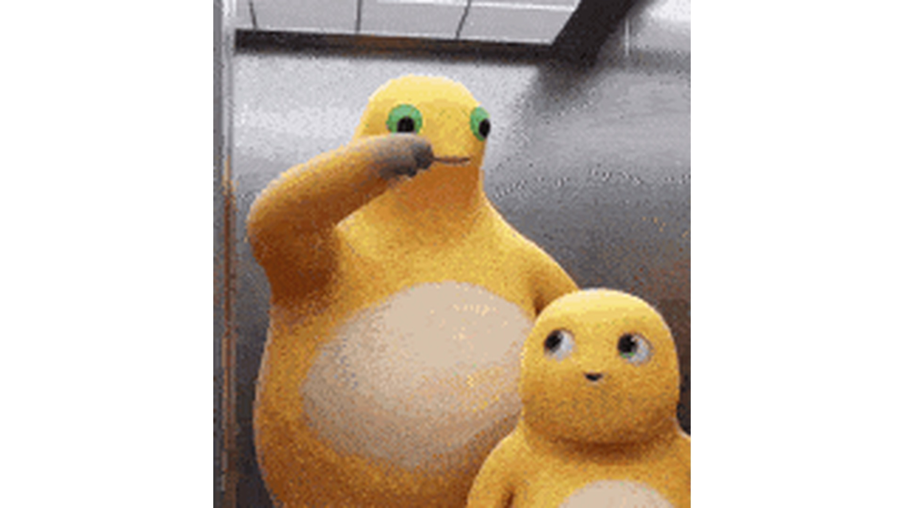
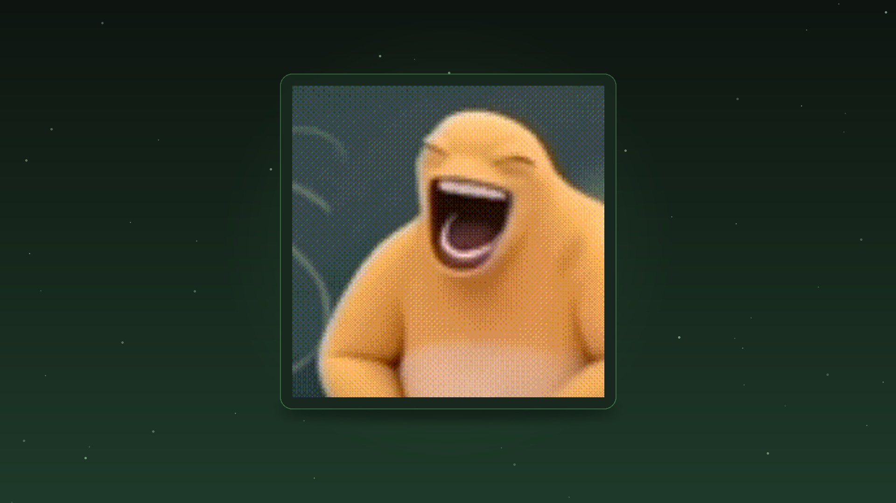
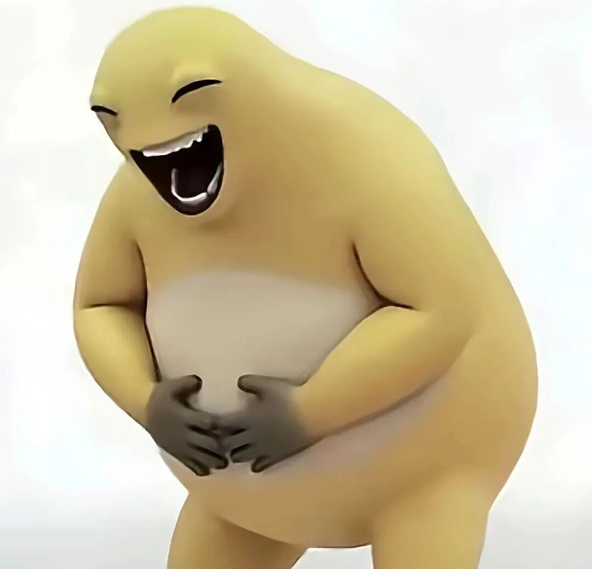
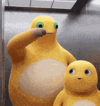
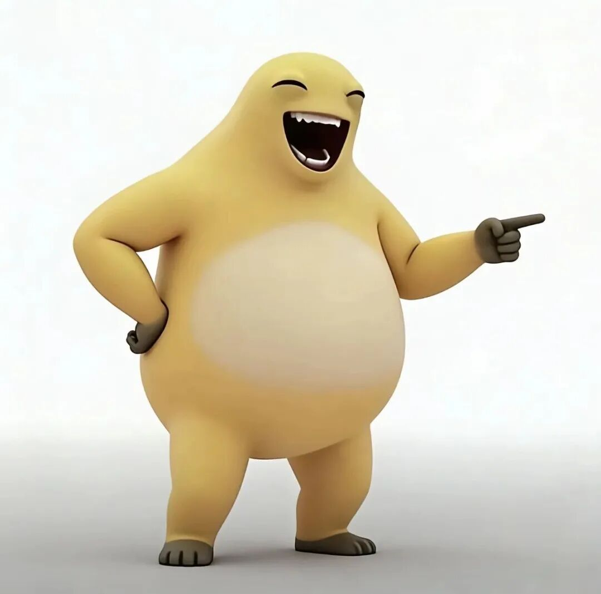

# NaiLong-Universe · 奶龙主题宇宙

<p align="center">
  
</p>

> 警告：使用本主题包可能导致沉迷电脑、摸鱼率飙升、老板狂怒。奶龙不承担任何责任，奶龙只是个卖萌的。

一个让奶龙住进你电脑的仓库。开机见奶龙，写代码见奶龙，摸鱼也见奶龙。
从此你的电脑不再是电脑，是奶龙的窝。软件可以换，奶龙不能没有。

## 仓库里有啥

| 目录 | 内容 | 干啥用 |
| --- | --- | --- |
| `wallpapers/` | 壁纸库（134 张 · 子模块 `Nailong-Studio/wallpaper`：22 卡片 + 38 名画 + 9 特别艺术 + 29 竖屏 + 36 艺术创作） | 让屏幕每一寸都是奶龙 |
| `themes/windows/` | Windows 桌面主题（.theme） | 开机就是奶龙的世界 |
| `themes/macos/` | macOS 外观设置指南 | 苹果也逃不过奶龙 |
| `themes/terminal/` | 终端配色（Windows Terminal / iTerm2 / VS Code） | 敲命令都敲出奶龙味 |
| `emotes/` | 表情包素材库（22 张，静图+动图） | 斗图弹药库 |

## 壁纸

134 张壁纸（子模块 [`Nailong-Studio/wallpaper`](https://github.com/Nailong-Studio/wallpaper)，`--recurse-submodules` 拉取），分五馆陈列：`fullhd/` 22 张卡片海报风（1920x1080 **原图直出**，不裁剪不P图，白底无缝衔接）+ `classic/` 38 张名画系列（1920x1080 为主，油画质感，世界名画奶龙主演）+ `special/` 9 张特别艺术（奶蛙的永恒/孤独奶龙主义）+ `phone/` 29 张竖屏（最伟大的奶龙 1080x1920）+ `art/` 36 张艺术创作（B站二创，获授权）。

<p align="center">
  
  
  
</p>

全部壁纸见子模块 [`wallpapers/README.md`](https://github.com/Nailong-Studio/wallpaper/blob/main/README.md)（本地 `wallpapers/` 需 `git clone --recurse-submodules` 或 `git submodule update --init`），用 `scripts/make_wallpapers.py` 可自行批量生成（请去壁纸仓提 PR）。

## 画廊导航站

在线浏览 134 张壁纸：https://nailong-studio.github.io/NaiLong-Universe/ （分类浏览 + lightbox 下载，原图直链 wallpapers/*）

## 表情包素材库

奶龙表情包 22 张已入库，静态图和 GIF 都有，拿去斗图、二次配字都行。

<p align="center">
  
  
  
  
</p>

完整清单看 [emotes/README.md](emotes/README.md)。

## 快速开始

别急，一个一个来：

1. [壁纸](wallpapers/README.md) - 先让桌面变成奶龙窝
2. [Windows 主题](themes/windows/README.md) - 窗口也要奶里奶气
3. [macOS 主题](themes/macos/README.md) - 苹果用户请自觉排队
4. [终端配色](themes/terminal/README.md) - 程序员快乐水
5. [表情包素材库](emotes/README.md) - 斗图弹药，无限开火

## 支持矩阵

| 平台 | 壁纸 | 主题 | 终端配色 | 状态 |
| --- | --- | --- | --- | --- |
| Windows 10/11 | 有 | 有 | 有 | 建设中 |
| macOS | 有 | 有 | 有 | 建设中 |
| Linux (GNOME) | 有 | 画饼中 | 有 | 建设中 |

状态说明：所谓"建设中"，就是"还没做完，但已经吹出去了"。

## 配色参考

- 底色：暖黑 `#121212`，选区暖棕 `#2E2511`，护眼到感动
- 主色：奶黄 `#FFD54F` / `#F9A825`，眼睛绿 `#66BB6A` / `#2E7D32` 点睛
- 文字：奶白 `#E8F5E9`
- 对齐：与 `Nailong-Studio/nailong-vscode-theme` 1.0.0 保持一致
- 宗旨：深色系，夜猫子友好，老板不友好

## 调色板单源（必读，仿 Catppuccin，省得改错）

**不要手改 `themes/` 下的色值！** 全组织唯一真源是 `palette.json`（`version 1.0.0`，`nailongDark` / `nailongLight` 各 26 色，含 hex/RGB/HSL）。所有主题都由它生成：

```bash
# 生成全部
python3 scripts/generate.py --all
# 只生成终端三件套
python3 scripts/generate.py --port terminal
# 校验是否与单源一致（CI 会跑）
python3 scripts/generate.py --check
```

- 生成产物：`themes/terminal/nailong-vscode.json` / `windows-terminal.json` / `nailong.itermcolors` + `themes/windows/NaiLong.theme`
- 独立仓 `Nailong-Studio/nailong-vscode-theme` 和 `Nailong-Studio/wallpaper` 也通过 `resources/ports.yml` 注册，复用同一 `palette.json`（已同步到 `nailong-vscode-theme/palette.json`）
- 新增 Port：看 `docs/port-creation.md`，模板照抄即可
- 规范：`docs/style-guide.md` 已对齐 `catppuccin` 的 `palette` + `ports.yml` 机制

> 壁纸已独立为 `Nailong-Studio/wallpaper`，别再往 `wallpapers/` 丢图，去那边提 PR。

## 贡献

欢迎投喂（先看 `docs/style-guide.md`）：

- **壁纸**：已独立为 `Nailong-Studio/wallpaper`，请去那边按分辨率提 PR，别再往本仓 `wallpapers/` 丢图
- **主题/终端**：一律改 `palette.json`，跑 `python3 scripts/generate.py --all`，**不要手改 `themes/`**；新增工具看 `docs/port-creation.md`
- 命名别乱来，格式 `nai-long-<场景>-<编号>`
- 提交前跑 `python3 scripts/generate.py --check` 保证与单源一致，再看 README 要不要跟着改

## 致谢

特别感谢以下 B 站 UP 主的二创授权与素材分享：

- **泽央 zeyang**
- **防御老猫**
- **超能尼尔尼尔**

以上均为 B 站 UP 主，已获明示可二传/二创，烦请使用时备注来源。侵删。

## 版权声明

- 奶龙角色形象版权归其版权方所有，本项目是粉丝向资源合集
- 壁纸与表情包素材来自网络公开资源及上述 B 站 UP 主授权二创，为粉丝整理，非官方出品
- 请只上传合法来源或已获授权的资源，并按原作者要求备注来源
